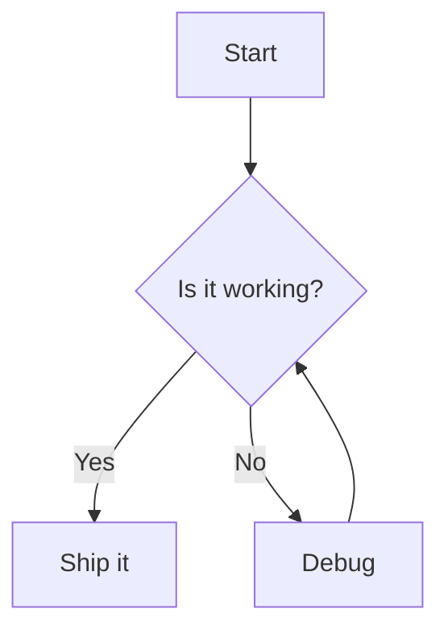
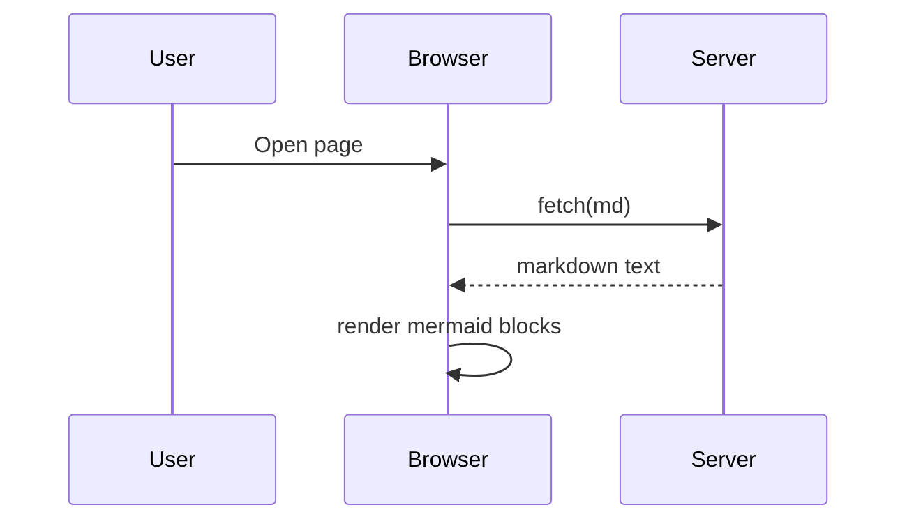

# Mermaid Demo

Some text before the diagram.

```mermaid
flowchart TD
    A[Start] --> B{Is it working?}
    B -- Yes --> C[Ship it]
    B -- No --> D[Debug]
    D --> B
```

Some text between diagrams.

```mermaid
sequenceDiagram
    participant User
    participant Browser
    participant Server
    User->>Browser: Open page
    Browser->>Server: fetch(md)
    Server-->>Browser: markdown text
    Browser->>Browser: render mermaid blocks
```
